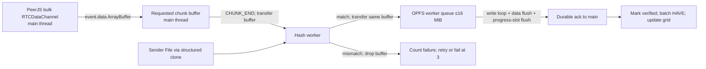

# P2P Share — Sub-step 0 Design

**Status:** Sub-steps 0–3 approved; Sub-step 4 implementation complete, pending review. No S5.

This document folds in Parts 1–4 and all follow-up answers. Part 1–3 decisions and approved answers are binding. Remaining implementation-specific choices are recorded as proposals.

## 1. Sub-step 0 report

- **Built:** this design; exact npm pins for PeerJS and Playwright; `.nvmrc`; `.gitignore` rules for `node_modules/`, `config.local.json`, and scratch probes.
- **Commands:** `cd real-app`; `npm ci`; later sub-steps use `npm test` (`node --test`). For the one-time browser probe, the temporary commands were `node scratch/s0-browser-probe.mjs headless` and `node scratch/s0-browser-probe.mjs headed`. The scratch script was removed after its output was recorded.
- **Browser result:** both headless and headed Chrome 154 connected two pages through an RTCDataChannel and transferred bytes `[1,3,3,7]`; both also opened a sync access handle in a DedicatedWorker, wrote/read four bytes, and removed the temporary OPFS entry. No flags were needed.
- **What did not work:** the first sandboxed Chromium launch was denied with `spawn EPERM`. An initial probe script also hung; it was corrected and both requested modes then passed under elevated execution. No product behavior was tested.
- **PeerJS/OPFS/browser mismatches:** PeerJS 1.5.5 defaults include public static-credential TURN servers, so the app must pass an explicit RTC configuration to avoid silently using them. PeerJS 1.5.5 has a public `dataChannel` property and an internal 8 MiB send queue. Chromium M130+ supports transferring an RTCDataChannel to a DedicatedWorker; Stage 1 rejects that approach because PeerJS owns channel event handlers. OPFS API and sync-handle worker probe passed in this Chrome build. Whether `truncate(size)` reserves physical quota was not measured.
- **Measured numbers:** see the results table at the end. No throughput, memory, multi-GB object-URL, quota-reservation, or real-device transfer measurements have been made.
- **Budget:** Sub-step 0 budget is 2 fix cycles; 2 used, 0 remaining. Planned budgets: S1 10, S2 15, S3 20, S4 20 fix cycles. A cycle is edit → requested test/browser check → read result. Stop at the budget or after 3 consecutive cycles on the same failing test.
- **Open questions:** listed in Section 14. Required proposed defaults for real-device testing and disk-full behavior are included.

### Pinned Sub-step 0 toolchain

| Tool | Pin | Evidence |
|---|---:|---|
| Node.js | 24.21.0 (`.nvmrc`) | `node --version` |
| PeerJS | 1.5.5 exact (`package.json`, `package-lock.json`) | installed package metadata and source/types |
| Playwright | 1.63.0 exact dev dependency | installed package metadata |
| Chromium used for probe | Chrome 154.0.8037.97 | executable version metadata |

PeerJS is not loaded from a CDN. The installed package has `dist/bundler.mjs` (ESM), `dist/bundler.cjs` (CommonJS), `dist/peerjs.js` and `dist/peerjs.min.js` (UMD), plus `dist/serializer.msgpack.mjs` and `dist/types.d.ts`. With no bundler, the proposed S1 approach is to vendor the pinned ESM distribution under `real-app/vendor/` and keep the npm pin as its source of truth.

## 2. D1–D14 decisions

| Decision | Chosen value | Rationale |
|---|---|---|
| D1 — chunk sizing and order | **Approved table:** `0 < size ≤ 256 MiB` → 64 KiB; `256 MiB < size ≤ 1 GiB` → 256 KiB; `1 GiB < size ≤ 4 GiB` → 1 MiB; `4 GiB < size ≤ 256 GiB` → 4 MiB. `chunkCount = ceil(size/chunkSize)`. Config `order: random | sequential`, default `random`; per-receiver Fisher–Yates using the shared crypto RNG. This deliberately deviates from the original nextPow2/2048 formula: 4096 grid cells matches the canvas maximum and the extra control traffic is negligible. | Keeps count at or below 4096 through 4 GiB, bounds manifest/bitmap size, and avoids modulo bias. |
| D2 — peer identity and connections | Raw PeerJS ID string is canonical; remote identity is always `conn.peer`, never a message field. Each peer has a control DataConnection (JSON strings only) and a bulk DataConnection (binary frames only), each opened before sending. Pair by raw peer ID and sender-issued `sessionId`; bulk metadata carries that `sessionId`. One session per peer. | Keeps identity unambiguous while separating protocol traffic from bulk frames. |
| D3 — TURN (A2) | Settings panel backed by per-tab/per-origin `sessionStorage`: ICE URLs, username, credential, force-relay, Apply & reconnect, Clear. Apply tears down/recreates Peer; sender reuses its persisted ID. Always pass explicit `config` to `new Peer(...)`; custom config fully replaces PeerJS defaults, so explicitly supply both `iceServers` and `sdpSemantics: "unified-plan"`. Default is Google STUN only (`stun:stun.l.google.com:19302`), no TURN; force-relay sets `iceTransportPolicy: "relay"`. Credential endpoint option (b) is rejected because credentials belong in local tab settings and must not be deployed or exposed. Local coturn with static long-term credentials for deterministic forced-relay tests; public static TURN only for unreliable manual smoke checks. | Credentials are entered on each tab/device that needs a relay; direct paths need no TURN credential. No third-party scripts because same-origin scripts can read sessionStorage. |
| D4 — manifest and file ID | Canonical bytes are: 8-byte ASCII magic `P2PSHARE`; u16 BE protocol version; u32 BE UTF-8 name length; raw `TextEncoder` bytes of `File.name` (no Unicode normalization); u64 BE file size encoded as two u32 BE halves; u32 BE chunk size; u32 BE chunk count; then one 32-byte SHA-256 digest per chunk in index order. Parse the u64 as `hi * 4294967296 + lo` using Number arithmetic; BigInt is banned by H5. `fileId = SHA-256(canonical bytes)`, 64 lowercase hex characters. `fileId` is excluded from the bytes to avoid recursion. | Receiver can hash reconstructed bytes against link `fid` before trusting fields. Including the raw name makes same-byte files with different names distinct, and split u32 parsing supports offsets above 2^32 without BigInt. |
| D5 — file/link bounds | Reject empty files; max UTF-8 name length 4096 bytes; max 65,536 chunks; max file size 256 GiB under D1. Share link has exactly one `room` (raw Peer ID) and one `fid` query parameter; reject duplicates, invalid IDs, or non-lowercase 64-hex `fid`. Sizes/counts must be safe integers and fit declared wire fields. Display names are sanitized and inserted with `textContent`. | Bounds make manifest (at most 2,101,278 bytes) and BITFIELD (at most 8,192 bytes / 16 KiB hex) bounded and compatible with 64 KiB control messages. Accepted by user. |
| D6 — ownership locks | Sender holds an exclusive Web Lock keyed by its persisted sender ID before creating its Peer. Receiver holds a file-ID Web Lock before any OPFS access, including probe cleanup. A duplicate tab shows “already open” and does not touch file-ID OPFS entries. | Prevents ID collisions and concurrent access to a single OPFS file/sync handle. |
| D7 — sender bytes | 64 MiB global across receivers; 16 MiB per receiver. Count is reserved chunk buffers plus sum of all bulk `bufferedAmount`. Reserve `chunkLength` before `slice().arrayBuffer()`; release after the last frame is handed to the data channel. Enforce `counted ≤ 64 MiB` in code. Grants are round-robin. | Caps sender memory under slow receivers and prevents a few fast peers from monopolizing reservations. Browser overhead is not included; measure with Chrome Task Manager. Four stalled 4 MiB receivers can exhaust the global cap; others wait without retry storms. |
| D8 — BITFIELD and holders | Stage 1 sender sends no BITFIELD and is treated as holding every chunk. A valid peer BITFIELD is a snapshot that replaces that peer’s holder set; later HAVE adds indices and REJECT NOT_HAVE removes one. At most one BITFIELD per peer/session. Receivers request only from known holders; if missing chunks have no holder, show a visible error. | Snapshot then deltas make resumed state accurate and avoid retaining stale holders. |
| D9 — OPFS durability/resume | One sync access handle per file in the OPFS worker. Entries are `data-<fid>.bin` and `progress-<fid>.bin`. `truncate(size)` before data writes; treat it as logical sizing until measured as physical reservation. For each chunk, loop partial writes until complete, flush data, update the inactive fixed-size progress slot (`magic, version, generation, chunkCount, bitmap, SHA-256 checksum`), flush that record, then acknowledge/mark verified/send HAVE. Resume selects the newest valid slot; rehash marked chunks before trusting them. | HAVE must mean the verified bytes and resume state are durable. A crash between data flush and progress flush causes a safe re-download. Two slots preserve the prior valid state if a progress update tears. |
| D10 — receiver memory | Max 8 requested/in-flight chunks, 32 MiB receiver in-flight, OPFS write queue capped at 16 MiB. Reassembly buffers exist only for requested `(index,attempt)` pairs. | Prevents untrusted peers from causing unbounded allocation; queue backpressure stops new requests before the queue cap. |
| D11 — sender ID | Persist one 128-bit lowercase-hex ID generated from `crypto.getRandomValues`; enforce one tab with the D6 Web Lock. On `unavailable-id` while holding the lock, retry the same ID with backoff. Only an explicit user click may choose a new ID. | Refreshes retain links, and accidental collisions do not silently invalidate them. PeerJS accepts hex IDs. |
| D12 — retry/resume | Receiver order is randomized by default. On sender drop: retry after 1, 3, and 9 seconds; then show Retry and auto-retry every 15 seconds for 5 minutes. Reconnect creates a new session, checks the same `fileId`, sends a fresh BITFIELD, and requests missing chunks only. Different `fileId` shows “sender is now sharing a different file (or the same file under a different name)”. A holder drop in a future mesh re-requests from remaining holders. | Retries recover sender refreshes without discarding verified OPFS chunks or creating a rapid retry storm. |
| D13 — limits/violations | Default max receivers 10; excess gets ERROR ROOM_FULL and close. HELLO within 5 seconds of control open; bulk pairing within 10 seconds. At most 8 receiver in-flight requests; sender serves 4 concurrently per receiver and queues up to 8; excess receives BUSY. Request+CANCEL sanity cap 2000/s with burst 64; in-flight limit is the primary limiter. Repeated excess in-flight requests are violations. Disconnect after 10 violations in 30 seconds, sending ERROR PROTOCOL first. Repeated request-rate excess counts as violations. | Protects browser memory and CPU while allowing legitimate high rates for 64 KiB chunks. |
| D14 — liveness/timeouts | PING/PONG either direction with safe-integer sequence, every 5 seconds (proposed cadence); no PONG for 15 seconds → UNRESPONSIVE. `bufferedAmount` above 1 MiB without `bufferedamountlow` for 30 seconds → STALLED. Either condition lasting 60 seconds total treats peer as left and frees reservations. **Proposed formula:** cold default 30 s; otherwise `clamp(5,60, 2*RTT + 2*chunkLength/max(measuredThroughput,64 KiB/s) + 2)` seconds for start; stall uses the analogous last-frame interval. A live frame/PONG while waiting for byte-cap budget means queued: no retry. Re-request at most once per chunk per timeout interval. | Separates a slow queue from a dead peer while bounding resource retention. Formula and 5-second ping cadence are proposed for approval. |

## 3. Wire protocol and connection sequence

### Connections and roles

1. Receiver opens control DataConnection; both sides wait for that connection’s `open` event.
2. Receiver sends `HELLO{role:"receiver", protocolVersion}`. Sender replies `HELLO{role:"sender", protocolVersion, sessionId}` or `ERROR VERSION` then closes. Opposite-role HELLO is a violation. Identity comes from `conn.peer` only.
3. Receiver opens bulk with metadata `{sessionId}`. Sender pairs it with the pending control connection from the same raw peer ID and session ID. Do not accept a second session for the same peer.
4. After control and bulk are open, sender sends MANIFEST_START, contiguous MANIFEST_DATA parts, MANIFEST_END. Manifest data is hex of canonical bytes, at most 16 KiB of original bytes per part.
5. Receiver checks exact manifest byte count/part sequence, hashes reconstructed bytes against link `fid`, then parses/validates limits. It runs storage checks, obtains D6 lock before OPFS, probes storage, loads/revalidates resume state, and sends one BITFIELD. It sends no REQUEST if complete.

Do not gate protocol work on an application state label. “State machine” below is derived, informational state only. Once a verified manifest and open bulk connection are facts, data can flow regardless of which UI state label last rendered.

### Control messages

All control payloads are UTF-8 JSON strings only; reject non-strings and messages over 64 KiB **before** `JSON.parse`. Parse inside `try/catch`. Every message has a string `type`; unknown type is a violation; unknown extra fields are ignored. Use hand-written validators, copy known fields into fresh objects, and never merge parsed input into existing state.

| Type | Fields and checks |
|---|---|
| HELLO | `role: sender|receiver`, `protocolVersion`; sender alone includes `sessionId`. |
| MANIFEST_START | `name,size,chunkSize,chunkCount,fileId,manifestBytes`; validate bounded safe integers before allocation. |
| MANIFEST_DATA | `seq,data`; contiguous sequence from 0; hex slice, at most 16 KiB decoded bytes. |
| MANIFEST_END | `parts`; exact number received. |
| REQUEST | `index,attempt`; safe in-range index, attempt 0–63. |
| HAVE | `indices`; unique, in range, at most 1024. |
| BITFIELD | `hex`; exactly `ceil(chunkCount/8)` bytes, lowercase hex, padding bits zero, one per peer/session. |
| CANCEL | `index,attempt`; stops new old-attempt frames from being queued. |
| REJECT | `index,attempt,reason`; reason is BUSY, RANGE, RATE, NOT_HAVE, SHUTDOWN, or READ_ERROR. NOT_HAVE removes only that chunk from that holder. |
| PING / PONG | `seq` safe integer, either direction. |
| ERROR | `code` in VERSION, FILE_CHANGED, ROOM_FULL, PROTOCOL, SHUTDOWN; message ≤200 chars, display with `textContent`. |

At most one BITFIELD per peer/session. A second is a violation. The Stage 1 sender accepts a valid receiver BITFIELD, including all-ones, and displays its completion percentage. Receivers only choose a holder known to have the requested index. If chunks are missing and no holder has them, show a visible “no connected peer has the missing chunks” error.

### Bulk frames

Sender→receiver only in Stage 1; any inbound bulk frame at sender is a violation. Use `DataView` (default big-endian), no shifts:

| Offset | Width | Field |
|---:|---:|---|
| 0 | 1 byte | type: 1 START, 2 DATA, 3 END |
| 1 | 1 byte | attempt u8 |
| 2 | 4 bytes | chunkIndex u32 BE |
| 6 | 4 bytes | offset inside chunk u32 BE |
| 10 | rest | payload |

Header is 10 bytes; DATA payload is 1–16,384 bytes; normal frames are exactly 16,384 payload bytes except the final DATA frame. Maximum frame is 16,394 bytes, accepted for the Chromium-only target. START offset is 0 and payload is chunkLength u32 BE; it starts the receiver’s start-timeout. DATA offset must equal bytes already received. END is empty and offset equals chunkLength, including exact-multiple chunks where the final DATA frame is full. `chunkLength = last ? size - index*chunkSize : chunkSize`; file offset is `index*chunkSize` using Number multiplication.

Validate byteLength ≥10, type, index, requested `(index,attempt)`, attempt equality, START-before-DATA, no DATA/END after END, exact offsets, in-chunk ranges, declared chunk length, and no oversize payload before using a field. Attempt mismatch is STALE: drop/count separately from violations. Frames already written to the channel cannot be recalled when superseded; sender stops queueing new old-attempt frames and receiver drops queued frames by attempt equality. Attempts are only 0–63; needing attempt 64 visibly fails that chunk. Three hash failures also visibly fail the chunk; retain other verified chunks.

### Manifest and file ID

`fileId` is SHA-256 of the canonical byte layout in D4, lowercase 64-hex. It is present in the receiver URL and verified before any manifest field is trusted. Outer manifest fields must exactly equal the parsed canonical fields; protocol v1 requires `chunkSizeFor(size)`. Name sanitation is for display/download only and does not change the canonical name bytes. Reject zero-byte files on both pages. Test one chunk, exact chunk size, size ±1, exact multiple, short last chunk, 1-byte file, `2^32 + 5` size parsed without BigInt, >4 GiB offsets, and the largest accepted size. `size` and Number offsets stay within `Number.MAX_SAFE_INTEGER`.

MANIFEST_DATA uses contiguous sequence numbers with no fixed part-count cap. At 65,536 chunks, the canonical manifest is about 2.1 MiB and takes about 131 parts. The sender slices and hex-encodes one ≤16 KiB byte range at a time; it never builds a whole-manifest hex string in memory. Receiver assembly checks contiguous `seq` values and bounded total `manifestBytes`, not a hard-coded `parts` maximum.

## 4. Sender, receiver, storage, and UI

### Sender

- Pick file, reject 0 bytes, then send the `File` via structured clone to hash worker. Hash one `file.slice(a,b).arrayBuffer()` at a time with `crypto.subtle.digest`; never load the whole source file. Build per-chunk digests and canonical manifest. Show hashing progress; reveal share link only after `fileId` exists.
- Generate/persist sender ID and acquire D11 Web Lock before Peer creation. Peer ID is lowercase 128-bit hex.
- Serve REQUEST on demand. Read only that file chunk, split into START/DATA/END frames, obey four simultaneous chunk sends per receiver, queue cap, global/per-peer byte budgets, and fair round-robin reservations.
- Sender concurrency pumps on new REQUEST, `bufferedamountlow`, and token availability. No polling timer. Upload cap defaults unlimited. If set, one global round-robin token bucket uses lazy refill from `performance.now()`, burst `max(2 frames, 100 ms of configured rate)`; when empty there is one timer for exact token deficit.
- Use `conn.dataChannel.bufferedAmount`, set `bufferedAmountLowThreshold`, listen to `bufferedamountlow`; PeerJS 1.5.5 types declare `dataChannel: RTCDataChannel`. Pause near 1 MiB, below PeerJS’s 8 MiB threshold, so its internal queue should not engage. If it engages, DEBUG-log and switch bulk sends to `conn.dataChannel.send` directly. Confirm in tests.
- `slice()` NotReadableError/NotFoundError → ERROR FILE_CHANGED to all receivers and end session. Optional DEBUG per-chunk corruption verification is off by default.
- Wake lock during transfer; reacquire on `visibilitychange`. Wake lock does not prevent timer throttling in hidden tabs.
- Per receiver show full raw peer ID, grid from BITFIELD/HAVE, percent, ~1s speed, direct/relayed path for both connections, and error state. Disconnected rows remain grey until cleared. Diagnostics show counted/peak bytes.

### Receiver and OPFS

- Strictly parse `room` and `fid`; connect and HELLO. Verify manifest against `fid`; then show sanitized name/size.
- Before first REQUEST call `navigator.storage.estimate()` and `navigator.storage.persist()`. Require `quota-usage >= fileSize*1.10 + 128 MiB`. If insufficient, hard-fail with required and available amounts. If `estimate()` is missing/fails, warn and proceed: “Could not verify available storage; transfer may fail if the disk fills”; DEBUG-log it. Missing OPFS `getDirectory` is hard unsupported. Separately warn that Download needs roughly another file size of free disk outside origin quota, which `estimate()` cannot measure.
- OPFS worker owns one `createSyncAccessHandle` per file, a byte-bounded 16 MiB queue, initial `truncate(size)`, data reads for Verify/Download, and progress metadata. Partial `write()` is handled by looping until all bytes are written. Queue backpressure pauses REQUEST issuance.
- Two-phase feature probe: phase 1 at worker load without OPFS access checks `FileSystemFileHandle.prototype.createSyncAccessHandle` and `navigator.storage.getDirectory`. Phase 2 only after D6 lock acquisition removes stale `probe-*` entries then opens/writes/reads/closes/deletes a unique `probe-<random>` file. Phase 2 failure is clearly reported as unsupported and releases the lock. A duplicate tab never touches OPFS.
- Send one BITFIELD after manifest verification/resume loading; batch HAVE for about 250 ms. Request at most 8 chunks, in own randomized order. Reassemble only requested buffers, hash, discard/count failure, re-request; three failures or attempt 64 fails visibly by chunk number.
- Sender loss: 1/3/9-second retry, Retry button after three fast attempts, slow retry every 15 seconds for 5 minutes. New session must pass same fileId; otherwise show different-file error. Same file requests only missing chunks. Network change has no PeerJS ICE restart; treat it as sender leave.
- Completion: Download button, abortable Verify whole file (OPFS worker re-reads chunks; hash worker verifies against manifest), Clear saved data. Try object URL for OPFS File; large-object URL capability is not detectable and is not measured. `showSaveFilePicker` is the fallback where supported.

### Canvas grid

At ≤4096 chunks, draw one cell per chunk; above that, one cell represents a range and its color/fill is the verified fraction in that range. States: missing gray; arriving blue with fill proportional to received bytes; verified green; hash failure red flash fading over about 500 ms. Redraw via batched `requestAnimationFrame`, never once per chunk event; no decorative/fake animation. Show verified %, smoothed MB/s, ETA, bytes verified, and bytes received. Receiver cells update from actual frame/hash/storage events; sender’s per-receiver grid updates from that receiver’s BITFIELD and batched HAVE.

### Diagnostics and debug controls

DEBUG-only ring buffer holds about 500 entries; copied diagnostics contain versions, UA, feature flags, redacted config, peers, counters, and recent logs. Corruption toggles have deterministic “always corrupt chunk N” mode and probabilistic “corrupt about 1% of CHUNK ATTEMPTS” mode, never 1% of frames. Sender defaults to no corruption and no per-chunk rehash before send.

### Buffer ownership and worker messages



Only transferable ArrayBuffers move between main/hash/OPFS worker. File is structured-cloned to hash worker. Proposed messages (all include `requestId` or `(index,attempt)` so late replies are stale-safe):

| Direction | Message | Transfer list / effect |
|---|---|---|
| Main→hash | `HASH_FILE {requestId,file,chunkSize}` | File structured-cloned, no transfer list. |
| Hash→main | `MANIFEST_READY {requestId,manifestBytes,fileId,chunkHashes}` | Transfer manifest and digest buffers; main sends canonical slices. |
| Main→hash | `VERIFY_CHUNK {index,attempt,buffer,expectedHash}` | Transfer `buffer`; expected hash is copied or separately transferred. |
| Hash→main | `CHUNK_HASH_OK {index,attempt,buffer}` | Transfer same chunk buffer onward to OPFS. Mismatch returns only index/attempt and drops buffer. |
| Main→OPFS | `INIT_PROBE_PHASE1`; then after lock `INIT_PROBE_PHASE2`; `OPEN_FILE`; `WRITE_CHUNK {index,attempt,offset,buffer}`; `VERIFY_READ {requestId,index,offset,length}`; `DOWNLOAD_READ {requestId,offset,length}`; `CLEAR` | Transfer write/read ArrayBuffers. Worker reports queue capacity before accepting work beyond 16 MiB. |
| OPFS→main | `PROBE_RESULT`, `OPEN_OK`, `CHUNK_DURABLE`, `READ_RESULT`, `CLEAR_OK`, `STORAGE_ERROR` | Read bytes transfer back. Durable ack occurs only after the ordered flushes in D9. |
| Any worker→main | `ERROR {name,message,requestId?}` | Handle worker `error` and `messageerror`; show a visible error and stop safely. |

This is the proposed protocol surface for approval; S1 will implement the exact discriminated validators and transfer lists.

### Derived receiver state

`CONNECTING → HAVE_MANIFEST → DOWNLOADING → COMPLETE | FAILED` is informational and derived from facts. Do not gate message processing on a state variable.

### UI, feature detection, and diagnostics

Two pages: `sender.html`, `receiver.html`; shared modules, clean/minimal UI. ICE panel uses A2 `sessionStorage`. Credentials never appear in logs, diagnostics, URLs, config examples, or deployments.

Required feature detection at load (show per-feature failure and disable the relevant page action):

| Feature | Detection | Fallback |
|---|---|---|
| Secure context | `isSecureContext` | “Open this app on HTTPS or localhost.” |
| Subtle crypto/RNG | `crypto?.subtle` and `crypto?.getRandomValues` | Block transfer: secure crypto is required. |
| Workers | `typeof Worker === "function"` | Block; hashing/storage workers are required. |
| Text encoding | `TextEncoder` and `TextDecoder` | Block; protocol requires UTF-8. |
| WebRTC | `RTCPeerConnection`, `RTCDataChannel` | Block transfer and show unsupported browser. |
| Backpressure API | `'bufferedAmountLowThreshold' in RTCDataChannel.prototype` | Block sender; event-driven pump requires it. |
| File slicing | `typeof File.prototype.slice === "function"` | Block sender. |
| Web Locks | `navigator.locks` | Block both pages; duplicate safety requires it. |
| Receiver OPFS | `navigator.storage.getDirectory` plus worker sync-handle phase 1 and phase 2 after lock | Block receiver with clear unsupported message. |

Optional detections and fallback: `navigator.wakeLock` → continue with warning; `navigator.storage.estimate/persist` → warning/proceed as above; `showSaveFilePicker` → object-URL download fallback; `sessionStorage` try/read/write → settings panel unavailable and default ICE settings only. No API reliably predicts very-large `URL.createObjectURL` behavior; report measured result and keep picker fallback.

Diagnostics are DEBUG-only: ring buffer last ~500 logs, peer states, both paths, RTT, violations/stale frames/hash failures/retries, current/peak counted bytes. Copy diagnostics as JSON with versions, UA, flags, redacted config, peer table, counters, recent logs. Never include ICE username/credential values. Render all peer/file/error text with `textContent`, never `innerHTML`.

## 5. PeerJS 1.5.5 and OPFS API verification

Verified from installed `node_modules/peerjs/dist/bundler.cjs`, `dist/types.d.ts`, and package metadata (version exactly 1.5.5):

| Check | Installed behavior | Design consequence |
|---|---|---|
| Raw serialization option | `peer.connect(id,{serialization:"raw"})`; enum `SerializationType.None === "raw"`. Receiver gets serialization from signaling. Raw serializer passes data directly. | Control sends JS strings; bulk sends ArrayBuffers. Do not use default/binary serializer. |
| RTCPeerConnection ownership | Each DataConnection constructs a Negotiator; each Negotiator creates its own `new RTCPeerConnection(provider.options.config)`. | Two connections mean two negotiations and can allocate TURN twice; paths may differ. |
| RTCDataChannel access | `BaseConnection.dataChannel` is declared public `RTCDataChannel` in types. It has `bufferedAmount`, threshold, `bufferedamountlow`, `send`. | Set threshold/listener on `conn.dataChannel`. |
| PeerJS internal send buffer | `MAX_BUFFERED_AMOUNT = 8,388,608`; when `bufferedAmount > threshold`, `_bufferedSend` queues and waits 50 ms before trying again. | Our ~1 MiB high-water should keep `conn.send` below the library threshold. Confirm in implementation; if it engages, DEBUG-log/use the public channel directly. |
| DataConnection events | `open: () => void`; `data: (unknown) => void`; `error: PeerError` (Error with `.type`); `close: () => void`; `iceStateChanged(state)` also exists. | Check `typeof data`, because raw mode can deliver strings or binary values. |
| Peer events | `open(id:string)`, `connection(conn)`, `error(PeerError)`, `disconnected(currentId:string)`, `close()`. | Errors use `.type`/`.message`; `unavailable-id` is `PeerErrorType.UnavailableID`. |
| Reconnect | `peer.reconnect()` is valid only when disconnected and not destroyed; it retries the last server ID. It throws for destroyed/invalid states. | Guard calls and preserve Peer instance/ID. A destroyed Peer must be recreated. |
| Peer ID grammar | `/^[A-Za-z0-9]+(?:[ _-][A-Za-z0-9]+)*$/` (empty is also accepted for server-assigned IDs). | 32 lowercase hex chars are valid; this app always supplies one. |
| Default ICE config | Google STUN plus PeerJS TURN `eu-0.turn.peerjs.com:3478` and `us-0.turn.peerjs.com:3478`, hardcoded `username:"peerjs"`, `credential:"peerjsp"`, and `sdpSemantics:"unified-plan"`. | **Mismatch:** library silently includes public static TURN unless app passes explicit `config`. See Open question 3. |
| Custom `config` | `PeerOptions` spreads app options over defaults, then passes `options.config` as the entire `RTCPeerConnection` config; it does not deep-merge `iceServers`. | Construct the full RTCConfiguration explicitly, including chosen iceServers and `sdpSemantics`. |
| Signaling hosts/protocols | Cloud host `0.peerjs.com:443`; ID REST call uses HTTPS (`/<key>/id`); signaling WebSocket uses WSS (`/peerjs?key=...&id=...&token=...&version=1.5.5`). | CSP needs `https://0.peerjs.com` and `wss://0.peerjs.com`; runtime custom host must be allow-listed. |
| Distribution | `bundler.mjs` ESM, `bundler.cjs` CJS, `peerjs.js`/`peerjs.min.js` UMD, `serializer.msgpack.mjs`, types. | No CDN/bundler; proposed vendored ESM for app. |

OPFS checks: the browser probe confirmed `navigator.storage.getDirectory`, worker `FileSystemFileHandle.prototype.createSyncAccessHandle`, create/write/flush/read/close/delete. `truncate(size)` physical reservation remains unverified. Phase-2 probe is strictly after file Web Lock; worker startup does no OPFS access.

## 6. Privacy and threat model

- Peers see each other’s IP addresses. Anyone with the share link can download; sender is responsible for content. TURN relays see metadata and relay bytes. The signaling server sees raw Peer IDs and connection metadata including sessionId. Persisted sender ID is a stable identifier visible to signaling service.
- PeerJS 1.5.5’s default public TURN credentials must be overridden explicitly (see open question). If TURN is used, sessionStorage credentials are readable by any same-origin script; no third-party scripts.
- Hash verification prevents silent receiver corruption but a malicious sender can waste bandwidth. HAVE can be spoofed; this matters more in a future mesh.
- `fileId` binds the raw name as well as file bytes; identical bytes under another name produce another ID.
- Static HTML CSP via `<meta>`: `default-src 'self'; script-src 'self'; worker-src 'self'; connect-src 'self' https://0.peerjs.com wss://0.peerjs.com` plus exact local signaling hosts/protocols used by `config.example.json` and tests. Node test verifies every example signaling host appears in both pages. A `securitypolicyviolation` for `connect-src` on a runtime custom host shows instructions to add it to the HTML CSP. WebRTC ICE traffic is not governed by CSP.
- Never log credentials; diagnostics config is redacted. No TURN credentials in URLs or deployed build.

## 7. Failure matrix

Every row is an acceptance case; tests must not be weakened or deleted to pass.

| Situation | Required behavior | Test method |
|---|---|---|
| Sender leaves/refreshes | Clear message; fast retries at 1/3/9 s, then Retry; same fileId resumes; new fileId shows different-file error. | Refresh sender mid-transfer; re-pick same file. |
| Receiver leaves | Other receivers continue; sender frees that receiver's active sends, buffers, and byte reservations; its row remains grey with zero counters. | Close 1 of 3 receivers around 50%; verify the other two complete and the disconnected row reports zero active sends/reservations. |
| Receiver stalls/unresponsive | STALLED at 30 s or UNRESPONSIVE after 15 s without PONG; after 60 s treated as left, resources freed; others unaffected. | Pause receiver JS with DevTools/CDP. |
| Global cap exhausted | Other receivers wait without retry storm, progress after release; count never exceeds 64 MiB. | Pause 4 receivers and keep 6 healthy; inspect counters. |
| Disk full / QuotaExceededError | Stop before REQUEST when estimated available bytes are below required; retain saved data and offer Clear saved data. If estimate fails, warn and proceed. | Production preflight Node test injects 64 MiB and 2 GiB available for a 500 MiB file and estimate rejection. CDP is blocked: `Protocol error (Storage.overrideQuotaForOrigin): Internal error`. |
| Three receiver upload fairness | Shared token bucket stays within aggregate cap and round-robin frames prevent one consumer monopolizing; byte-budget grants keep rotating. | Injected-clock Node tests with 3 consumers and byte-budget fairness; browser aggregate cap measurement pending. |
| OPFS offset probe above 4 GiB | Include actual partial-write count, offset, bytes remaining, handle size, and size after truncate in DEBUG diagnostics. Chrome 154 returned count 4,294,967,288 at offset 4,500,000,000, remaining 8, and file size 0 after truncate; a 4,000,000,000-byte target also failed. Does not establish a 4 GiB boundary. | `node scripts/s3-offset-probe.mjs`; HeadlessChrome 154.0.0.0, estimate 10 GiB quota and zero usage. |
| Repeated hash failure | Three failures produce visible chunk-number error; keep other verified chunks. | DEBUG deterministic corruption of chunk N. |
| Occasional corruption | Retry succeeds; counters visible. Corrupt ~1% of CHUNK ATTEMPTS, never 1% of frames. | DEBUG probabilistic attempt corruption. |
| Duplicate receiver tab, same room | Lock reports “already open”; fileId OPFS entries untouched. | Open same link twice in one profile. |
| Protocol mismatch | “Refresh the page”; end session. | DEBUG protocolVersion override. |
| Signaling server down | Visible error; retry with backoff/Peer.reconnect; current P2P transfers continue; new joins blocked. | Kill local signaling server during transfer. |
| File moved/changed | slice error → ERROR FILE_CHANGED to receivers; end session. | Rename/overwrite source; document OS-specific behavior. |
| Malformed frame/control | Drop/count; disconnect after violation threshold. | Fuzz harness and DEBUG live injection. |
| Sleep/hidden/discard | Wake lock while active; recover with reconnect/resume; document limits and hidden-tab timer clamp. | Lock screen, hide ≥2 min, Chrome Memory Saver discard. |
| TURN unavailable/forced relay | Show path per connection; work if relay reachable, clear error otherwise. | Local coturn forced relay with valid/invalid credentials; public TURN smoke only. |
| Late joiner/room full | First 10 receivers are admitted; the 11th gets ERROR ROOM_FULL and closes. | Node admission test at the 10-receiver boundary; browser/manual three-receiver acceptance. |
| Completed receiver reopens | All-ones BITFIELD accepted, sender shows 100%, no REQUESTs. | Finish; reload receiver. |
| Stale/wrong link | “File info doesn’t match the link”; fileId OPFS entries untouched. | Edit `fid`. |
| Worker crash/OPFS error/storage cleared | Visible stop/error; preserve progress where possible. | DEBUG kill worker; clear site data mid-transfer. |
| Sender duplicate tab/ID taken | Second tab lock fails, “already open”, no new ID. `unavailable-id` under lock retries same ID with backoff; new ID only on click. | Open two sender tabs; refresh quickly. |
| Network change | PeerJS has no ICE restart; treat as sender leave/reconnect/resume. | Document/manual Wi-Fi switch. |

## 8. Feature detection and fallbacks

At each page load, record a feature flag and show actionable text. Sender requires secure context, SubtleCrypto and getRandomValues, Worker, TextEncoder/Decoder, RTCPeerConnection/RTCDataChannel, `bufferedAmountLowThreshold`, File.slice, and Web Locks. Receiver additionally requires OPFS `getDirectory` and the two-phase worker sync-handle probe. Missing any required feature blocks the page action with the messages in Section 4. Optional wakeLock, estimate, persist, showSaveFilePicker, and sessionStorage warn/fallback as specified there. A failed storage estimate is warning-only; missing OPFS is hard fail.

Detection forms to implement in S1:

```js
const required = {
  secureContext: isSecureContext,
  subtleCrypto: !!crypto?.subtle,
  secureRandom: typeof crypto?.getRandomValues === "function",
  worker: typeof Worker === "function",
  textCodec: typeof TextEncoder === "function" && typeof TextDecoder === "function",
  rtc: typeof RTCPeerConnection === "function" && typeof RTCDataChannel === "function",
  bufferedAmountLow: typeof RTCDataChannel === "function" &&
    "bufferedAmountLowThreshold" in RTCDataChannel.prototype,
  fileSlice: typeof File !== "undefined" && typeof File.prototype.slice === "function",
  webLocks: !!navigator.locks,
};
```

Receiver feature check runs inside the OPFS worker; phase 2 is deferred until lock-held. Optional checks use guarded property access/try-catch, especially `sessionStorage` because access itself may throw.

## 9. Test plan and process

### Node tests (`node --test`, no test library)

Pure, DOM-free, PeerJS-free `src/lib/` modules: framing, manifest, bitfield, validators, token bucket, chunk-size rule, request scheduler with injectable clock/RNG. Seeded RNGs live only in `test/` or `scripts/`. All randomness in `src/` uses shared `crypto.getRandomValues` helper; rejection sample Uint32s with `limit=2^32-(2^32 mod n)`, redraw `>=limit`, Number arithmetic, no bitwise operators. Pool calls in batches ≤65,536 bytes. H5 scan flags `Math.random` in `src/`.

Test coverage: manifest encode/parse/fileId; D1 size table; validators; CSP config hosts; frames and reassembly; hash; token bucket; offset math at 2^32−1, 2^32, 2^32+1 and near 2^53; BITFIELD including all-ones, malformed length/nonhex/padding/duplicate; attempts/stale/64 cap; supersede and duplicate REQUEST; fairness scheduler; RNG rejection exhaustive over fake source; `Math.random` scan; 10-receiver byte accounting (never >64 MiB global or >16 MiB each, all progress, disconnect releases); A5 guard throws before allocation; fuzzed malformed/truncated/oversize/mutated messages never throw/allocate unboundedly.

Test file generator `scripts/make-test-file.js` streams seeded pseudo-random content (never holds whole file in memory); every chunk differs. Do not use zero-filled/sparse transfer files. Record expected SHA-256 via Node stream and external tool. S2 in-memory sink is one removable module, reassembles one Uint8Array, no Blob, hard 64 MiB guard before allocate; Sub-step 3 removes module and test asserts no file/import remains.

### Browser/acceptance tests

- Playwright is pinned; headless and headed Chromium probe already passed for WebRTC between two pages and sync-access-handle use in a Worker. Automated runs use local signaling, not public cloud.
- Manual acceptance windows side-by-side and not overlapping; fully occluded windows may be hidden. No background tabs. Event-driven pumps only; timers only watchdogs, HAVE flush, PING, and the single token-bucket wake-up.
- Separate contexts/origins do not share localStorage. Sender peer ID differs by context; pin ID explicitly or keep sender in one context. Avoid Incognito’s smaller quota.
- S1: hash 5 MiB file; HELLO/manifest and fid checks; pair both channels; PING/PONG; validators, features, CSP host check.
- S2: framing, backpressure, hash, real canvas events; test ≤64 MiB memory path; measured effect of 8 requests on LAN/small chunks.
- S3: OPFS + resume, download and whole-file verify; 500 MiB external hash; report duration, throughput, Task Manager steady memory, verify time. For offset >4 GiB check quota first; if <~6 GB, record reason and skip; otherwise truncate ~5e9, write ~4.5e9, read back. End-to-end 4.5 GB if feasible. Kill at ~50%, resume only missing chunks; completed re-open all-ones. Quota override disk-full.
- S4: 3 receiver profiles/origins with concurrent 500 MiB file; SHA-256s match; close one receiver; report sender cap observed, peak counted bytes, Task Manager memory. At least 3 runs for reported median; record hardware, OS, Chrome, network/path. Report upload cap aggregate and overhead.
- Relay: local coturn with static credentials, forced relay; invalid credentials fail visibly. Public TURN only manual smoke. Physical device run uses HTTPS mechanism from open question.
- Never weaken/delete tests. If a sub-step exceeds its cycle budget or same test fails 3 consecutive cycles, stop and ship/retain previous tag.

### Fix-cycle budgets

| Sub-step | Budget |
|---|---:|
| S0 design/verification | 2 cycles (used 2; 0 remain) |
| S1 skeleton/signaling | 10 cycles |
| S2 transfer/framing | 15 cycles |
| S3 OPFS/resume | 20 cycles |
| S4 multiple receivers/upload cap | 20 cycles |

Commit and tag each completed sub-step (`real-app-s0` through `real-app-s4`). Stage only `real-app/` (`git add real-app/`); do not touch `.github/` or other repo paths. Stop after each sub-step and report built files, exact run commands, pasted test output, failures, mismatches, real measurements, budget used/remaining, and open questions. Sub-step 0 has no product code. Wait for user approval after this design before any code.

## 10. Failure/recovery details

- Per chunk hash mismatch discards the buffer; retry via any known holder. Third hash mismatch fails that chunk visibly and stops requests for it. Already verified chunks remain available.
- When a sender supersedes an attempt, it stops adding frames for the old pair immediately. Bytes already queued at RTCDataChannel cannot be recalled; receiver rejects them as STALE.
- Counted sender bytes include dataChannel.bufferedAmount while the sender chunk buffer is reserved. Byte cap includes all receivers; other peers wait if reservations held by a stalled connection. Release all reservations on disconnect/60-second left decision.
- Disk-full policy is an approval question; proposal retains verified file/progress, closes access handles/releases memory, and offers Clear saved data.

## 11. Browser probe transcript (copied output)

Commands run from `real-app/` (scratch script deleted afterward):

```text
node scratch/s0-browser-probe.mjs headless
Starting headless Chromium probe...
{
  "headless": {
    "dataChannelBetweenPages": true,
    "received": [
      1,
      3,
      3,
      7
    ],
    "worker": {
      "getDirectory": true,
      "syncHandleMethod": true,
      "roundTrip": true,
      "cleanup": true
    }
  }
}

node scratch/s0-browser-probe.mjs headed
Starting headed Chromium probe...
{
  "headed": {
    "dataChannelBetweenPages": true,
    "received": [
      1,
      3,
      3,
      7
    ],
    "worker": {
      "getDirectory": true,
      "syncHandleMethod": true,
      "roundTrip": true,
      "cleanup": true
    }
  }
}
```

## 12. Deliverables

- `real-app/DESIGN.md` kept current.
- `real-app/README.md`: run instructions, support matrix, threat model, limitations, measured results (real values only), D4 filename note.
- `config.example.json` with signaling/ICE/TURN schema and no secrets; optional `config.local.json` ignored; A2 settings docs.
- Exact dependency versions/lockfile and `.nvmrc`.
- HTTPS deployment only if approved by the real-device-test decision; publish only `real-app/`.

## 13. Measured-results table

Method for final transfer results: total time is first REQUEST to last chunk verified; report sender hashing separately. Median of ≥3 runs. Include hardware, OS, Chrome, network (loopback/Wi-Fi/relay), path direct/relayed. Sender upload share = sender bytes/total delivered bytes; report protocol overhead.

| Test | File size | Receivers | Sender cap | Path | Total time | Aggregate throughput | Sender upload share | Runs |
|---|---:|---:|---:|---|---:|---:|---:|---:|
| S2 | 32 MiB | 1 | Unlimited | Not measured | 23,786 ms | 1.35 MiB/s | Not measured | 1 |
| S3 | 32 MiB | 1 | Unlimited | Not measured | 11,310 ms | 2.83 MiB/s | Not measured | 1 |
| S3 | 500 MiB | 1 | Unlimited | Not measured | 191,640 ms | 2.61 MiB/s | Not measured | 1 |
| S4 isolation | 500 MiB | 1 | Unlimited | Not measured | Not recorded | 4.54 MiB/s | Not measured | 1 |
| S4 isolation | 500 MiB | 1 | 10 MiB/s | Not measured | Not recorded | 4.58 MiB/s | Not measured | 1 |
| S4 isolation | 500 MiB each | 2 | Unlimited | Not measured | Not recorded | 3.60 MiB/s aggregate | Not measured | 1 |
| S4 concurrent | 500 MiB each | 3 | 10 MiB/s | Not measured | Not recorded | 1.90 MiB/s aggregate | Not measured | 1 |
| S4 close-one | 500 MiB each | 3, then 2 | 10 MiB/s | Not measured | Not recorded | 1.93 MiB/s aggregate during close run | Not measured | 1 |
| Stage 1 star | Not measured | 3 | Not measured | Not measured | Not measured | Not measured | Not measured | 0 |
| S0 browser capability probe | 4-byte payload | 2 pages | n/a | local host candidate | Passed headless + headed; duration not retained | Not measured | n/a | 1 each |

S2 acceptance note (one run, not a three-run median): 32 MiB transferred in 23,786 ms after the first REQUEST, 1.35 MiB/s, 8/8 request slots observed, Chrome 154.0.8037.97, same-host local PeerServer, measured control RTT 360 ms. The downloaded file hash matched the Node streaming source hash. S3 32 MiB: SHA-256 `2192f924af776c33c016258112acca3eebecee139c534cefa8229a3e455cb972`, reconnect requested exactly 255 missing chunks, verify 1,053 ms, working set 652.4 MiB. S3 500 MiB: SHA-256 `8ef7b878120c20d4feb6b8d974e408335c15e1ff6abb0f72e6e5e01bb71da24a`, revalidated 1,000 durable chunks and requested exactly 1,000 missing chunks, completed reopen showed 2,000/2,000 and zero REQUESTs, verify 1,339 ms, working set 1,050.9 MiB. S3 results are single-run observations, not medians. A one-cycle receiver change that sent PONG directly on the control RTCDataChannel measured 325 ms RTT and 1.30 MiB/s, so it was reverted. Measurement quirk to revisit: one hypothesis is that PONG handling is delayed by bulk-frame processing on the receiver main thread.

S4 results are single-run observations on Chrome 154.0.8037.97, Windows, with same-host local signaling and three visible independent receiver profiles for the concurrent test. The unlimited 1-receiver and capped 1-receiver runs measured 4.54 and 4.58 MiB/s; the 2-receiver unlimited run measured 3.60 MiB/s aggregate. In the three-receiver capped run, all three 500 MiB downloads matched SHA-256 `8ef7b878120c20d4feb6b8d974e408335c15e1ff6abb0f72e6e5e01bb71da24a`; aggregate throughput was 1.896 MiB/s with a configured 10 MiB/s cap, so this run did not saturate the cap. The close-one run closed a receiver after exactly 250 MiB durable; the other two completed with matching SHA-256 values. Its sender row returned to zero active sends and zero reserved bytes. Close-run aggregate throughput was 1.935 MiB/s; peak counted sender bytes were 5,760,812 and peak Chrome process working set was 2,590.2 MiB.

S4 bug found during isolation: `pumpFrames()` referenced `tokenBlocked` in the `do…while` condition after declaring it inside the block. The resulting `ReferenceError` was caught as a read failure, causing REJECT/retry loops before payload frames were queued. The flag now has function scope; the one-, two-, and three-receiver browser runs passed after the fix.

OPFS offset probe on HeadlessChrome 154.0.0.0: after `truncate(5,000,000,000)`, an 8-byte write at offset 4,500,000,000 returned 4,294,967,288 (`2^32 - 8`) with all 8 bytes remaining; `getSize()` after truncate was 0. The same return value occurred at the 4,000,000,000 target. This is observed Chrome OPFS backend behavior, not a JavaScript offset cast; it does not establish a 4 GiB-only boundary. No more probing was performed. S2–S4 results are one-run observations, not medians.

## 14. Approved answers and remaining questions

The five Sub-step 0 questions are resolved: real-device verification is post-S4 with no hosting/certs/flags in S1–S4; disk-full retains verified data/progress and releases memory/handles with a Clear saved data action; explicit Peer config defaults to Google STUN only with no TURN and includes `sdpSemantics`; D1/D5 bounds and manifest layout are accepted; timeout formula and cadence are accepted. S2 and S3 are approved. S4 implementation and browser acceptance are complete, pending review; no S5 exists.
